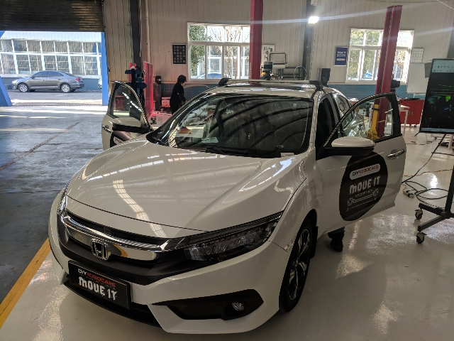
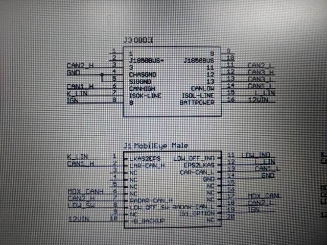
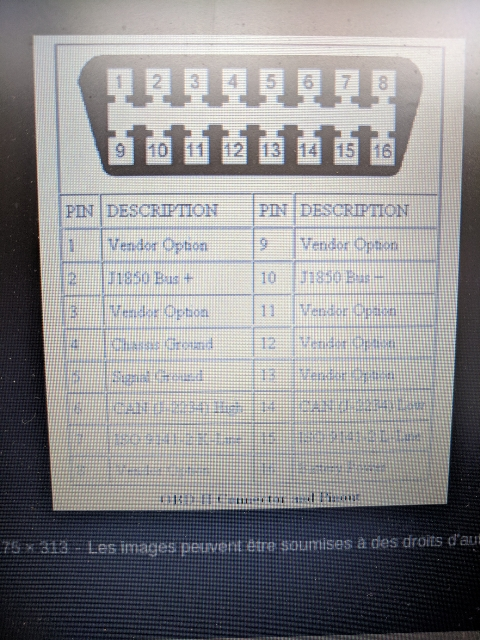
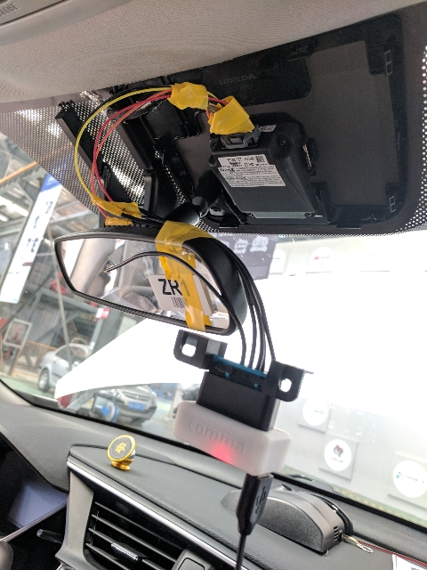
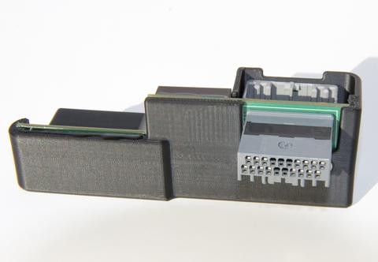

# Blog about how we got where we got


For the Honda Civic 2016 from the PixMoving MoveIt hackathon:



## Connect to the CAN bus

We needed to connect to one of the CAN buses (it has two). We made a connector to attach ourselves
to the camera thing.

Pinout of the connector of MobilEye:



Pinout of the ODB II connector:



Which the hacky setup of the panda board connected to the MobilEye connector in the car looks like:



Would have been better to use the [Giraffe adapter](https://shop.comma.ai/products/giraffe-honda) if we had one:




We used a Pandacan board ([wiki](https://community.comma.ai/wiki/index.php/Panda#LED_Indicators), [github docs](https://github.com/commaai/panda), [how to get started](https://medium.com/@comma_ai/a-panda-and-a-cabana-how-to-get-started-car-hacking-with-comma-ai-b5e46fae8646) [hardware guide](https://github.com/commaai/panda/blob/master/docs/guide.pdf)) to connect to the CAN bus and a laptop to it. 

It's extremely easy to use, just install `pip install pandacan` and you can be reading the CAN bus with:

```python
from panda import Panda
p = Panda()
data = p.can_recv()
# Up to 256 CAN messages
print(data)
# Looks like:
# [(420, 55639, bytearray(b'\x00f\x00\x00\x00\x00\x00:'), 0),
# (428, 55761, bytearray(b'\x7f\xff\x00\x00\x00\x08\x002'), 0),
# ... ]
```

Note that you may need to add [linux udev rules](https://community.comma.ai/wiki/index.php/Panda#Linux_udev_rules) to be able to run without root scripts that use Panda.


## Understand the CAN data

We looked at the [comma.ai openpilot](https://github.com/commaai/openpilot) project. There is useful code for many cars. We found difficult to compile the dependences so we extracted the useful bits for us for our car.

Those were:
* DBC file for Honda Civic 2016: [honda_civic_touring_2016_can_generated.dbc](https://github.com/commaai/openpilot/blob/devel/opendbc/honda_civic_touring_2016_can_generated.dbc) (Which we needed to modify slightly to allow cantools library to load it).
* [hondacan.py](https://github.com/commaai/openpilot/blob/devel/selfdrive/car/honda/hondacan.py) which contains code to create messages, checksum calculation, etc.
* [carstate.py](https://github.com/commaai/openpilot/blob/devel/selfdrive/car/honda/carstate.py) which contains code to read what's the state of the car. This was the first file that guided us in the right direction to find the DBC file, and the hondacan messages.

So we could load the CAN messages like this:

```python
from cantools.db import load_file as load_dbc_file

can_msg_parser = load_dbc_file('honda_civic_touring_2016_can_for_cantools.dbc')

# Find the messages we understand at
print can_msg_parser.messages
```

And we can decode the CAN messages recorded with the Panda like (continuing previous code):
```python
from panda import Panda
panda = Panda()

data_block = panda.can_recv()
# data_block looks like:
# [(420, 55639, bytearray(b'\x00f\x00\x00\x00\x00\x00:'), 0),
# (428, 55761, bytearray(b'\x7f\xff\x00\x00\x00\x08\x002'), 0),
# ... ]
# Where 420 is the frame id or code for the message
# To see it in hex you can do hex(420)
for msg in data_block:
    print can_msg_parser.decode_message(msg[0], msg[2])
    # You'll get something like:
	# {'BRAKE_HOLD_ACTIVE': 0,
	#  'BRAKE_HOLD_ENABLED': 0,
	#  'CHECKSUM': 10,
	#  'COUNTER': 3,
	#  'ESP_DISABLED': 0,
	#  'USER_BRAKE': -0.015625}

```


The list of messages we can understand can be found here [Understood_messages.md](panda_bridge_ros/Understood_messages.md).


## Publish it in ROS

We made a ROS node, initially, to publish the CAN messages as `can_msgs/Frame` messages, which can be found here:
[panda_bridge_ros.py](panda_bridge_ros/scripts/panda_bridge_ros.py)

```bash
rostopic echo /can_frame_msgs
header: 
  seq: 1352
  stamp: 
    secs: 1520746948
    nsecs: 469939947
  frame_id: ''
id: 330
is_rtr: False
is_extended: False
is_error: False
dlc: 8
data: [254, 239, 255, 161, 7, 254, 210, 3]
```


To also understand what was going on in a more human friendly way (altho not being exceptional) we made a node that prints in a Python dictionary
shape a string with the decoding of the message here:
[frame_decoder.py](panda_bridge_ros/scripts/frame_decoder.py)

```bash
rostopic echo /can_frame_msgs_human_friendly
data: {'STEER_ANGLE_OFFSET': -0.7000000000000001, 'CHECKSUM': 3, 'COUNTER': 3, 'STEER_ANGLE_RATE': 0, 'frame_id': 330, 'STEER_WHEEL_ANGLE': 25.6, 'raw_msg': '\xff\x00\x00\x00\x07\xff\x003', 'STEER_ANGLE': 25.6, 'message_name': 'STEERING_SENSORS'}
---
```

Later on we added being able to also send CAN messages thru another `can_msgs/Frame` topic on the node:
[bridge_and_send.py](panda_bridge_ros/scripts/bridge_and_send.py).

Find the full docs on the package itself: [panda_bridge_ros](panda_bridge_ros/README.md).


## Control the car

We made a script to test sending steering commands: [set_steering.py](honda_controlling_scripts/set_steering.py)

And another one to test sending braking commands: [set_braking.py](honda_controlling_scripts/set_braking.py)

We tried them with the car lifted up from the front and the messages didn't do anything. We were warned
that the steering could only do minimal torque but we could not making rotate the steering wheel.

And also that in theory the car cannot be commanded under 12mph (20km/h~). Seems to be true.


## Hacking the torque sensor on the steering wheel to send steering commands

Seems to be feasible. Sensor readout seemed to be varying from 0.5V(max right torque) to 4.5V (max left torque). With 2.5V at 0 torque. Th sensor output would need to be studied more closely with an oscilloscope to see if ther is any kind of modulation on the signal in order to authenticates it.

To provide a good position control, we would have had to tap directly on the SAS (steering angle sensor) to get an angle readout in real time. The CAN readout could have been used also at the expence of a slower control loop.

It would have been a good idea to also read the original torque signals to trigger a disengagement of the drive by wire mode (DBW).


