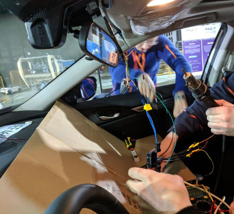
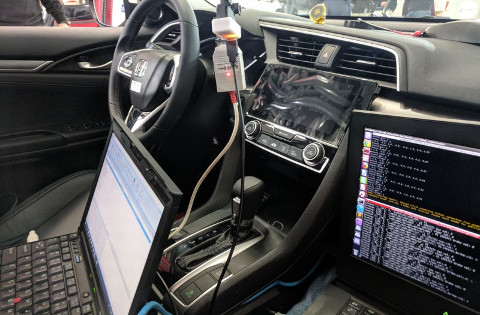

# Civic CAN Hack - related code & packages

---

This repository contains packages, code and documentation on how we hacked an Honda Civic 2016 Touring for the [pixmoving moveit hackathon](https://www.pixmoving.com/move-it).

You can explore our decisions and things we tried in [our little journal](BLOG.md).

## Screenshots

## Features
* Uses an XBox controller as an input device
* Controls the steering in a torque and rate limited way when rolling above 20kph (EPS firmware limitation)
* Full braking authority at any speed

## Stuff Left To Do
* Achieve full steering capability at any speed. Could be done by hacking the steering torque sensors.
* Achieve full throttle control at any speed. Could be done by using the newly released [comma pedal](https://twitter.com/comma_ai/status/973282986178129920).

## Try it yourself
### Hardware requirements
* [Panda](https://shop.comma.ai/products/panda-obd-ii-dongle) + USB cable
* Either a [Girafe](https://shop.comma.ai/products/giraffe-honda) or a good old soldering iron/crimper + an OBD-II connector.
* Honda Civic Touring 2016 (should work also with other 2016-2018 Civics with LKAS functionnality)
* Decent laptop + Xbox Controller
* [Bosch ScanTool](https://www.alltiresupply.com/products/north-american-comprehensive-diagnostic-scan-tool?variant=16349255301) to reset those errors.

### Software Dependencies
 * Python 2.7
 * ROS Kinetic
 * Ubuntu 16.04
 * [cantools library](https://github.com/eerimoq/cantools) :`pip install cantools`
* [pandacan library](https://shop.comma.ai/products/panda-obd-ii-dongle) :`pip install pandacan`
* [can_msgs](http://wiki.ros.org/can_msgs) : `sudo apt-get install ros-kinetic-can-msgs`

### "Panda in the middle attack"
In order to fake the messages comming from the camera, you need to use the panda as a gateway. To do so, you need to cut the can wires comming from the ADAS camera to insert the Panda in the middle.

In our case, can 1 (see [Panda's Hardware Guide](https://github.com/commaai/panda/blob/master/docs/guide.pdf)) was plugged to the camera and can 0 was wired to the rest of the car.

If you do this without a [Giraffe](https://shop.comma.ai/products/giraffe-honda), don't forget to insert CAN termination resistors between CANH and CANL on the newly created CAN subnet (120Ohms near the camera and 120Ohms near the Panda).

Now you need to flash the Panda with the right software branch (see below). In order to do this hack the Panda will block the relevant incomming messages from the camera. 

The tricky part is that the relevant scripts need to be running and boradcasting messages before the car is booted up. Indeed, the checksum and the counters contained in those messages need to always be consistent. If the car/EPS detects an error, it may deactivate its steer/brake by wire functionnality. You may need to use an [OBD-II ScanTool](https://www.alltiresupply.com/products/north-american-comprehensive-diagnostic-scan-tool?variant=16349255301) to reset those errors.

### Flashing the panda
See our forked repo of the Panda's firmware repo: https://github.com/pixmoving-moveit/panda

Use the **moveit-hackathon-forward-can-1-to-0** branch to flash the panda to do the full bus forwarding.

Use the **moveit-hackathon-steer-brake-gas** branch to flash the panda in order to do the "Panda in the middle attack".

### Unbricking the panda
If ever you modifiy the panda's firmware and by doing so you brick your panda, you can either use the panda paw [sold here](https://shop.comma.ai/products/panda-paw). Or open the panda's case and short the 5V from USB plug to the [boot0 pin](https://github.com/commaai/panda/blob/master/docs/guide.pdf) to enter DFU mode while powering up the panda.

## Credits

Thanks to [comma.ai](https://comma.ai/) for its incredible [software](https://github.com/commaai/openpilot), [databases](https://github.com/commaai/opendbc) and [hardware](https://shop.comma.ai/products/panda-obd-ii-dongle). Without it, the hacking process would have been a lot more tedious.

## License

MIT

